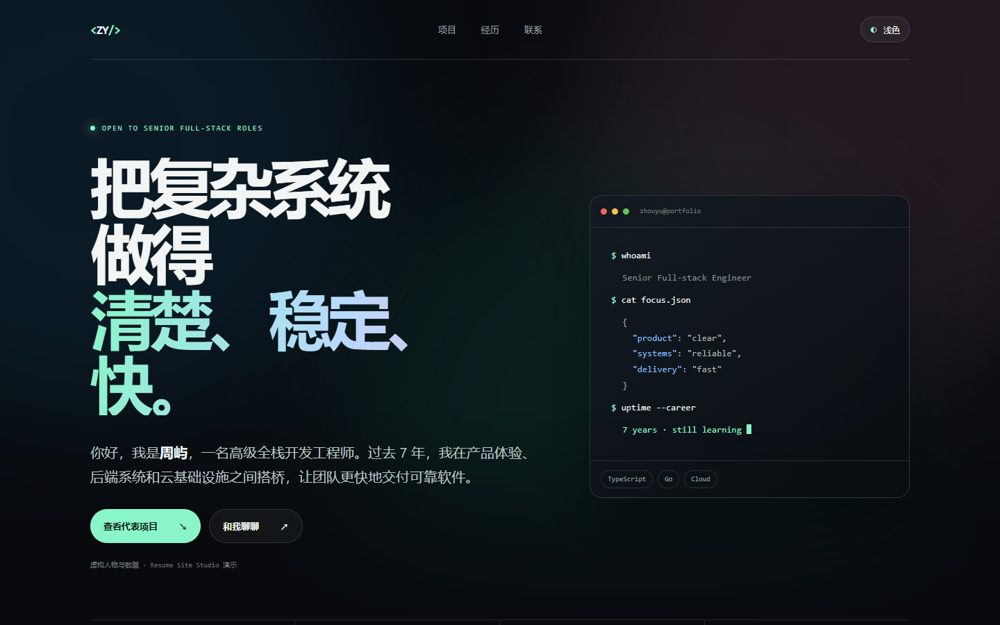
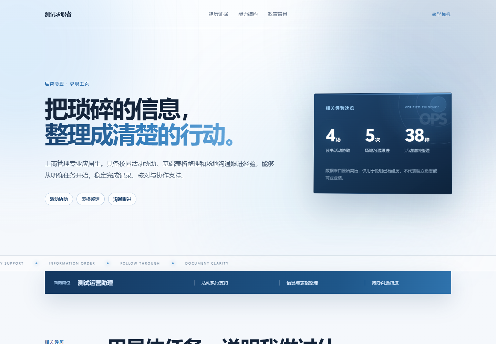
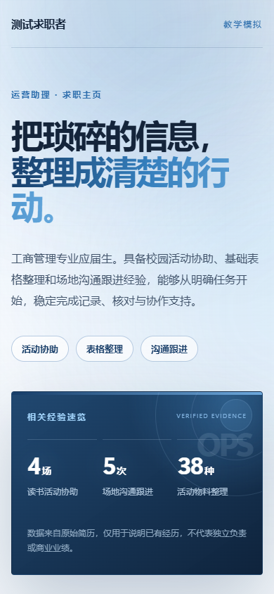

# Resume Site Studio · 简历网站工坊

这是一个可单次安装的求职与简历网站主 Skill。它内置职位匹配证据分析器，可先分析招聘要求和真实经历，再把简历、履历或项目资料转换成可编辑的个人网站。核心是通用的 `SKILL.md`，没有平台专属命令、付费服务或外部依赖。`assets/starter/` 是可选的静态网站示例，包含专业和动态两种展示模式。示例里的“林序”及其履历均为虚构内容。

## 一键下载

**[下载 v2.1.0 中文豪华版安装包：resume-site-studio-v2.1.0-cn.zip](https://github.com/magicjacky/resume-site-studio/releases/download/v2.1.0/resume-site-studio-v2.1.0-cn.zip)**

[下载 v2.1.0 标准跨平台包](https://github.com/magicjacky/resume-site-studio/releases/download/v2.1.0/resume-site-studio-v2.1.0-portable.zip)

[查看全部版本与更新说明](https://github.com/magicjacky/resume-site-studio/releases)

中文界面安装包用于 WorkBuddy 和豆包工作，标题、简介和详情说明均为中文；标准跨平台包用于 Codex、Claude Code 和严格遵循 Agent Skills 规范的平台。两个包都包含主 Skill 和 `job-fit-evidence-analyzer` 模块。

v2.1.0 将默认网页质量提升为案例级展示：即使用户要求“简洁、专业、浅色”，也会生成具有沉浸式首屏、光影层次、证据数字、丰富区块节奏和克制动态的高质感网站，而不是普通文档式网页。

## 案例展示

下面是使用本 Skill 制作的全栈开发工程师简历网站。人物、公司、学校、项目和指标均为虚构演示数据。

[在线预览](https://magicjacky.github.io/resume-site-studio-demo/) · [案例源码](https://github.com/magicjacky/resume-site-studio-demo)

### 桌面端首屏

### 项目案例区

### 移动端

  

### 浅色豪华版模板

  

## 包含内容

- `SKILL.md`：跨平台工作流程与交付标准。
- `modules/job-fit-evidence-analyzer/`：内置的职位匹配、硬门槛和证据缺口分析 Skill。
- `references/`：事实提取、动态设计和验收清单。
- `assets/starter/`：无需构建即可预览的 HTML/CSS/JavaScript 示例。
- `assets/templates/professional-light/`：默认的浅色豪华职业展示模板，包含沉浸式首屏、证据面板、滚动进度和响应式动效。
- `agents/openai.yaml`：Codex 可选展示信息；其他平台可忽略。
- `scripts/package_workbuddy.py`：同时生成中文界面包和标准跨平台包。
- `scripts/SKILL.zh-CN.md`：WorkBuddy、豆包工作专用的中文标题、简介和完整说明。
- `dist/resume-site-studio-cn.zip`：中文界面安装包。
- `dist/resume-site-studio-portable.zip`：标准跨平台安装包。

## 安装

只需复制或导入整个 `resume-site-studio` 文件夹一次。主 `SKILL.md` 会根据任务自动读取内置模块，不需要再单独安装 `job-fit-evidence-analyzer`。不同平台的装载入口如下；具体产品版本可能调整入口位置。

| 平台 | 安装方式 |
| --- | --- |
| Codex | 使用标准跨平台包，复制到用户技能目录（本机可用 `~/.codex/skills/`；新版文档也列出 `~/.agents/skills/`）或项目的 `.agents/skills/`。 |
| Claude Code | 使用标准跨平台包，复制到 `~/.claude/skills/`，或项目的 `.claude/skills/`。 |
| WorkBuddy | 下载中文安装包，在 Skill Marketplace 的“添加技能 → 上传技能”导入。安装包包含 `display_name: 简历网站工坊` 以及中英文描述。 |
| 豆包工作 | 下载中文安装包，在“插件 · 技能 · 伙伴 → 技能 → + 添加 → 上传技能”导入。根 `name`、`description` 和正文均为中文。 |
| 千问办公 | 复制到 `~/.qwenworkcn/skills/`，或在“扩展 → 技能 → 安装技能”上传 `SKILL.md` 和辅助文件。 |

可以直接下载上方的最新版 ZIP，用于支持 ZIP 导入的平台。仓库中的 `dist/resume-site-studio-cn.zip` 是同一安装包的源码仓库副本。安装后只需要调用 `resume-site-studio` 或“简历网站工坊”；主 Skill 会根据任务自动读取内置模块。

### 界面语言说明

- WorkBuddy 官方格式支持 `display_name`、`description_zh` 和 `description_en`，中文安装包已经写入这些字段。
- 豆包工作直接使用根 `SKILL.md` 的 `name` 和 `description` 作为标题和简介，因此中文安装包将这两个字段都设为中文。
- 标准跨平台包保留 `name: resume-site-studio`。Agent Skills 标准要求它使用小写字母、数字和连字符；中文界面包则针对允许中文名称的 WorkBuddy 和豆包工作单独生成。
- 当前通用规范没有“跟随电脑系统语言自动切换”的字段，所以分别提供中文界面包和标准跨平台包。

建议先在各平台用一句话测试触发：“用 resume-site-studio 根据我的简历做一个个人网站，先生成本地预览。”能否自动触发取决于平台的技能发现机制；也可以直接指定技能名。

## 预览示例

直接打开 `assets/starter/index.html`。动态模式使用 CSS 渐变色雾与滚动出现动画；右上角可切换至明亮、安静的专业模式。系统设置为“减少动态效果”时会停用主要动画。无需联网或安装依赖。

## 使用真实简历

提供简历和目标用途（求职、个人介绍、作品集或学术主页），并说明愿意公开的联系方式。让技能先生成本地网站，确认文字、隐私和视觉效果后再发布。技能不会凭空补写经历、成果或量化指标。

如果网站面向某个明确职位，主 Skill 会自动调用内置的 `job-fit-evidence-analyzer`，生成职位要求与个人证据的对应表，再选择首页重点。用户也可以只让主 Skill 输出职位匹配报告，不生成网站。

## 许可与来源

本仓库采用 PolyForm Noncommercial License 1.0.0。允许非商业使用、修改和分发；分发时需要保留许可证和 Required Notice。商业使用需要另行授权。设计与流程参考项目及许可说明见 [THIRD_PARTY_NOTICES.md](THIRD_PARTY_NOTICES.md)。
